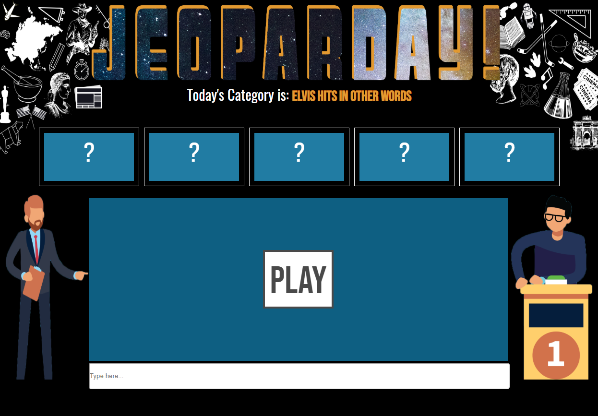
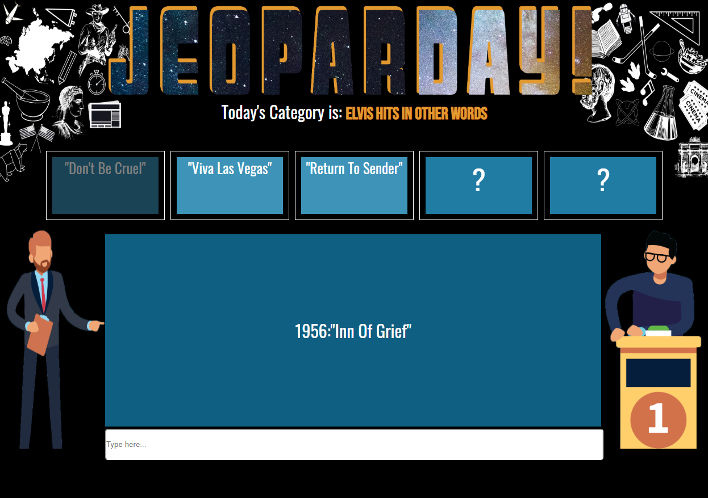
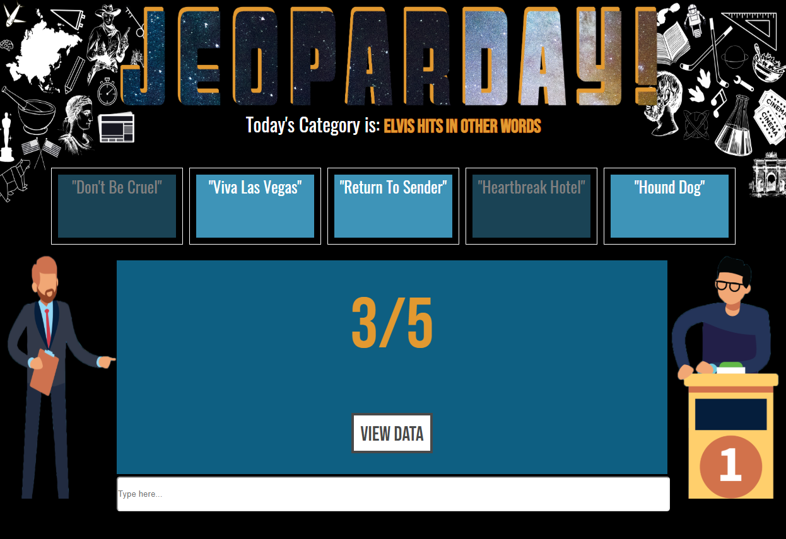
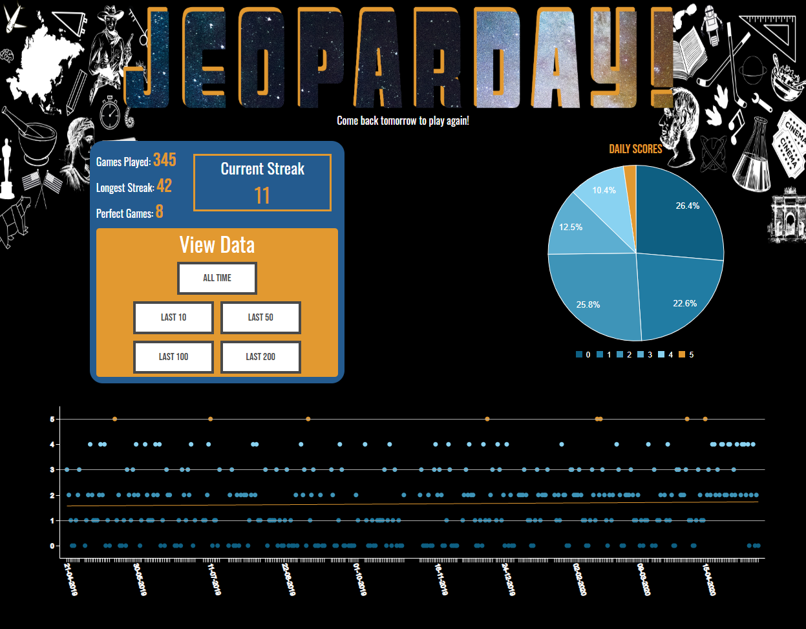
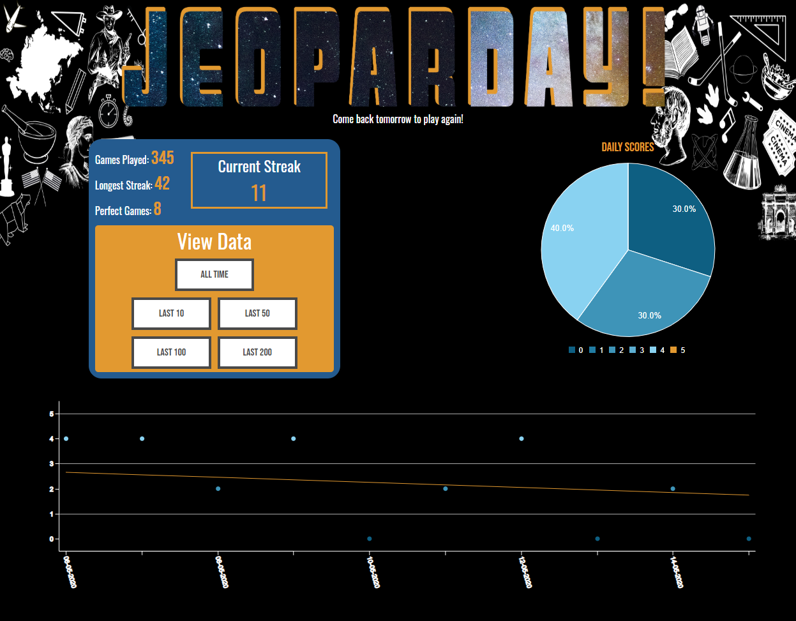

# JEOPARDAY! 

This is a game app that gives you daily Jeoparday style questions! Once you've anwsered your daily set of questions you can then see your data visualized to track your progress. 

## What it does: 

#### 1. Upon opening the App for the first time in a calendar day, you'll be faced with the questions page, Simply Press "Play" to begin your first game. 



#### 2. Every day you will recieve 5 questions from a Jeopardy Category to test your trvia chops (NO GOOGLING).



#### 3. Once you are finished for the day it will display your score and offer to take you to your personal data page.



#### 4. Your data page holds all your past game stats including your longest streak (Number of days played in a row), your  current streak, the number of 5/5 games you've had and the total number of games you've played.  The visulizations inclue a pie chart indicating the percentages of your daily scores and a scatter plot showing your score against time. Hovering over a dot will display the category you faced on that day. A line of best fit in included to help display a trend.



#### 5. You can also choose a subsection of data to visulize (last 10 games for example). The pie chart and scatter plot will update accordingly.



## Tech Stack

To make Jeoparday I used React with create-react-app and used local storage to hold the user data.  The scatter plot and pie chart were made using C3 and react-c3js respectively. All of the information for the questions and answers came from the [jService API](http://jservice.io/).

## Installation

**NEW:** Deployed on Netlify until I implement a backend. Link [HERE](https://jeoparday.netlify.app/)

You can also clone the repositiry on your computer and run from there (why...). Use the following commands to do so. 

```bash
   git clone https://github.com/Brendan-G5/Jeoparday.git
   npm i 
   npm start
```

This should open up the app and be ready to play!  

## Future Goals and Improvments

~~Nothing is ever finished~~ This app is finished but could use some touch ups.

- jService can sometimes have answers/questions in weird formats, while the app corrects for most, it does not do all.

- It would be lovely to add a average score value on the data page.
- The manifest.json is made and i have the app working as a chrome extension on my laptop, but the spacing is off when running in a chrome extension pop-down, upon fixing that the app could go on the chome store and be much more accessible.

- Using local storage isn't really ideal... creating a db as I  originally had planned for (and halfway finished) would be much better for speed/performance.

- On top of that last point using a database and deploying with heroku would allow me to set up a leaderboard page, keeping track of the top players around the world!

- A way to stop people from googling would be cool, I am hestiant to add a timer due to those of us that can't spell.

- A notification system that reminds you to play.

- Eventually it would be nice to have this as a chome extension.

## Contributors

Just me for now, but feel free to send a pull request with improvments (listed above or your own!)
